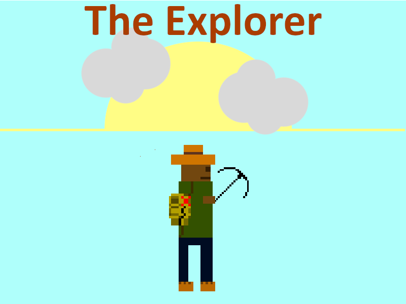

# The Explorer - A 2D Platformer
\
The Explorer is a 2D platforming game created with C++ and SDL  library for graphical output and keyboard interaction.

## Online Version
Web version is also available, created with Emscripten - **[click here to play](https://eldorz.itch.io/the-explorer)**.
## Game Jam
The game was originally created as a submission for the [“Weekly Game Jam – Week 271”](https://itch.io/jam/weekly-game-jam-271).
Jam theme: Uncharted Lands.
## Dependencies
In order to build this project the following libraries are needed:
- SDL2
- SDL2_image
## Building

Clone the repository and build with the following command (enter from root directory):

	g++ Source/main.cpp Source/Hook.cpp Source/Player.cpp Source/Spike.cpp Source/Enemy.cpp Source/LevelFinish.cpp Source/Block.cpp Source/InvBlock.cpp Source/LevelObjects.cpp Source/Background.cpp -lSDL2main -lSDL2 -lSDL2_image
    

